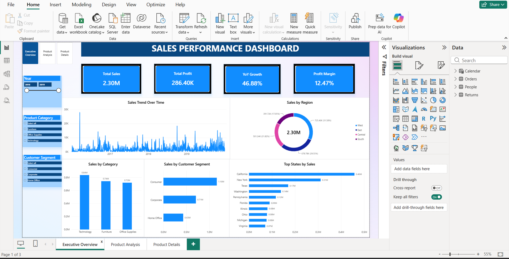
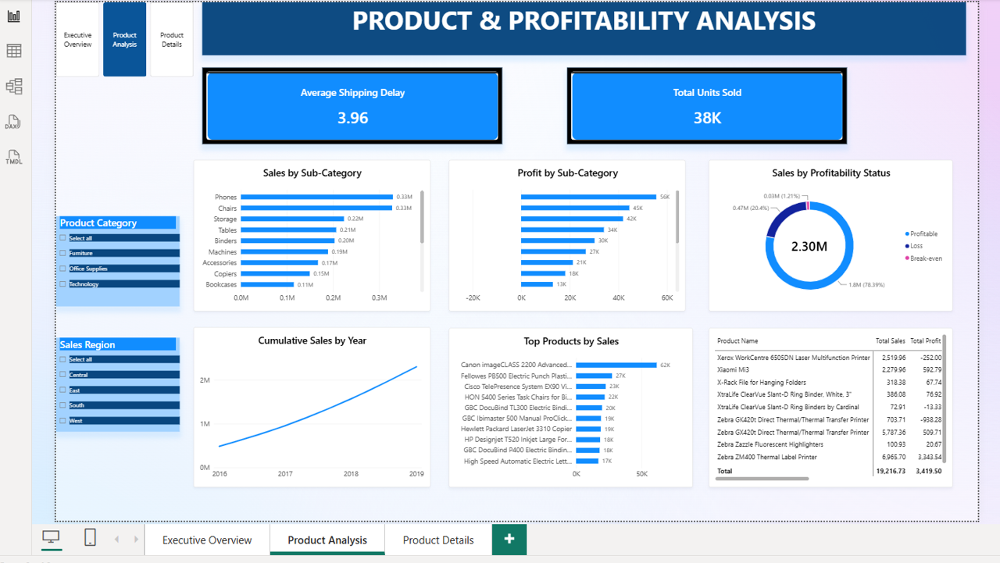
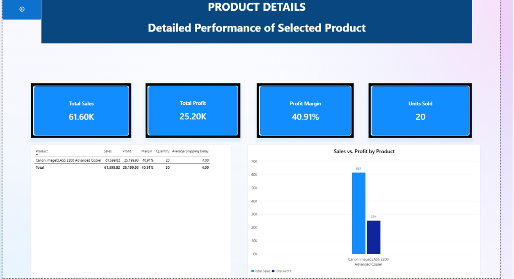

# Superstore Sales & Profit Analysis Dashboard

An interactive **Power BI dashboard** built to analyze sales performance, profitability, products, regions, customer segments, and overall business performance using the Sample Superstore dataset.

## 📊 Project Overview

This project provides an interactive business intelligence dashboard that transforms Superstore sales data into meaningful insights through data modeling, DAX measures, KPIs, and interactive visualizations.

The dashboard is organized into three main pages:

- **Executive Overview**
- **Product & Profitability Analysis**
- **Product Details**

## 🛠️ Tools & Technologies

- Power BI
- DAX
- Power Query
- Microsoft Excel
- Data Visualization
- Business Intelligence

## 📈 Key KPIs

The dashboard tracks several important business metrics, including:

- Total Sales
- Total Profit
- Profit Margin
- Year-over-Year Growth
- Total Units Sold
- Average Shipping Delay
- Sales by Region
- Sales by Category
- Sales by Customer Segment

## 📑 Dashboard Pages

### 1. Executive Overview

Provides a high-level view of business performance, including:

- Total Sales
- Total Profit
- YoY Growth
- Profit Margin
- Sales Trend Over Time
- Sales by Region
- Sales by Product Category
- Sales by Customer Segment
- Top States by Sales

### 2. Product & Profitability Analysis

Focuses on product performance and profitability:

- Average Shipping Delay
- Total Units Sold
- Sales by Sub-Category
- Profit by Sub-Category
- Sales by Profitability Status
- Cumulative Sales by Year
- Top Products by Sales
- Product-level performance table

### 3. Product Details

Provides detailed performance for a selected product:

- Total Sales
- Total Profit
- Profit Margin
- Units Sold
- Product performance details
- Sales vs. Profit comparison

## 🖼️ Dashboard Preview

### Executive Overview

### Product & Profitability Analysis

### Product Details

## 📂 Project Files

| File | Description |
|---|---|
| `data mini projct.pbix` | Power BI dashboard file |
| `Sample - Superstore 2019.xls` | Source dataset |
| `Executive-overview.png` | Executive Overview screenshot |
| `product-analysis.png` | Product & Profitability Analysis screenshot |
| `product-details.png` | Product Details screenshot |

## 🎯 Project Objective

The main objective of this project is to transform raw sales data into an interactive analytical dashboard that supports business performance analysis and helps identify trends across products, regions, categories, and customer segments.

## 💡 Business Insights

The dashboard enables users to explore:

- Overall sales and profitability performance
- Sales trends over time
- Regional sales performance
- Product and sub-category performance
- Customer segment contribution
- Top-performing states and products
- Profitability status across sales
- Detailed performance of selected products

## 📊 Dashboard Structure

The project follows a three-page analytical structure:

**Page 1 — Executive Overview**  
High-level business performance and sales overview.

**Page 2 — Product & Profitability Analysis**  
Detailed analysis of products, sub-categories, profitability, and sales performance.

**Page 3 — Product Details**  
Detailed product-level performance using interactive filtering.

## 👨‍💻 Author

**Ahmed Wardany**

Data Analyst | Power BI | SQL | Python | Excel

GitHub: [Ahmed Wardany](https://github.com/ahmedwardaed012012-coder)

---

### 📌 Project Repository

This repository contains the Power BI dashboard, source dataset, and dashboard previews used in the project.
